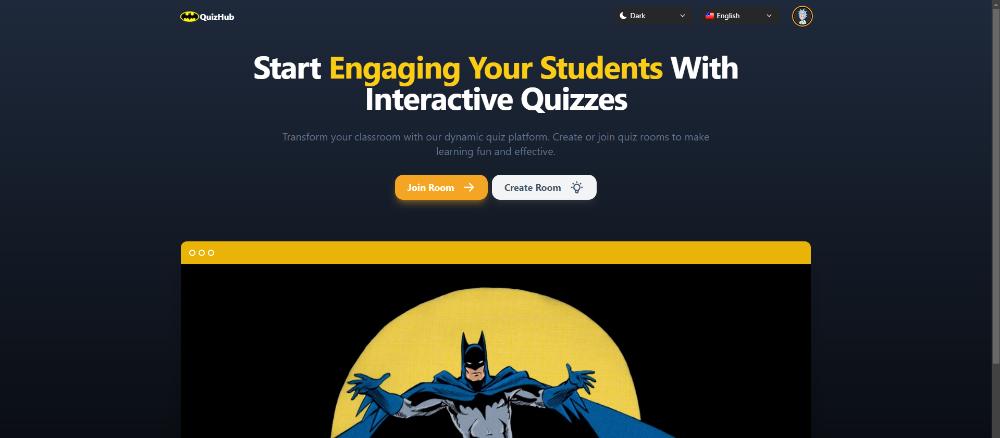
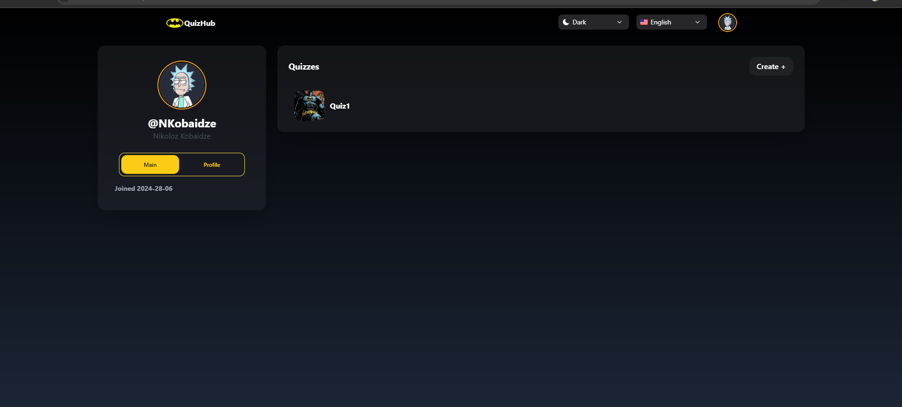

# Realtime Quiz Simulator

Welcome to QuizHub, a full-stack web application designed to facilitate interactive learning and collaboration between teachers and students.
## Table of Contents

- [Introduction](#Introduction)
- [Features](#features)
- [Technologies Used](#technologiesused)
- [Installation](#installation)
- [Usage](#usage)
- [Authentication and Authorization](#authentication-and-authorization)
- [Real-time Communication](#real-time-communication)
- [Screenshots](#screenshots)
- [Contributing](#contributing)

## Introduction

QuizHub offers a comprehensive platform for educational purposes, focusing on real-time quiz management, interactive rooms, and seamless communication tools for effective teaching and learning experiences.

## Technologies Used

- Frontend: Next.js, Tailwind CSS, NextUI
- Backend: Firebase, MySQL, Backend ASP.NET Web API
- Real-time Communication: SignalR WebSocket

## Features

- User authentication and authorization system.
- Real-time quiz management and room creation.
- Interactive quizzes with customizable questions and answers.
- Real-time chat for instant communication in waiting rooms.
- Real-time updates for user joins and leaves.

## Installation

To get started with QuizHub, follow these steps:

1. Clone this repository to your local machine.
2. Install dependencies using your preferred package manager (`npm install` or `yarn install`).
3. Set up the backend server and database.
4. Start the development server (`npm start` or `yarn start`).

## Usage

Explore QuizHub's features to enhance educational experiences:

1. Teachers can authenticate and create quizzes.
2. Students join rooms using a room ID and username.
3. Engage in real-time chatting in waiting rooms.
4. Experience seamless updates for user interactions.

## Authentication and Authorization

Our platform features a robust authentication and authorization system to ensure secure access to user accounts and data. Role-based permissions control user access to different features and functionalities, providing a seamless and personalized experience.

## Real-time Communication

Utilizing SignalR WebSocket, qighutbn enables real-time communication for instant updates and interactions within the platform.

## Screenshots

### Quiz Creator Page

### Registration

## Contributing

Contributions are welcome! Fork the repository, make your changes, and submit a pull request. Please follow coding standards and guidelines.
